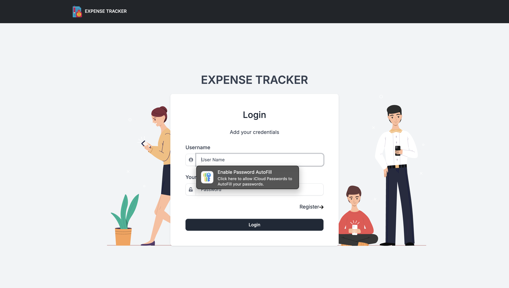
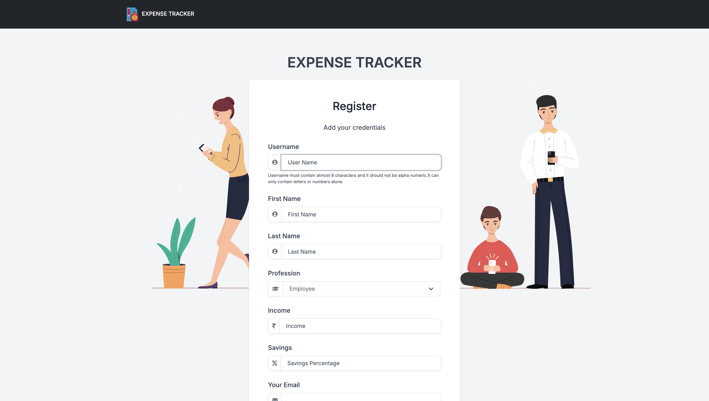
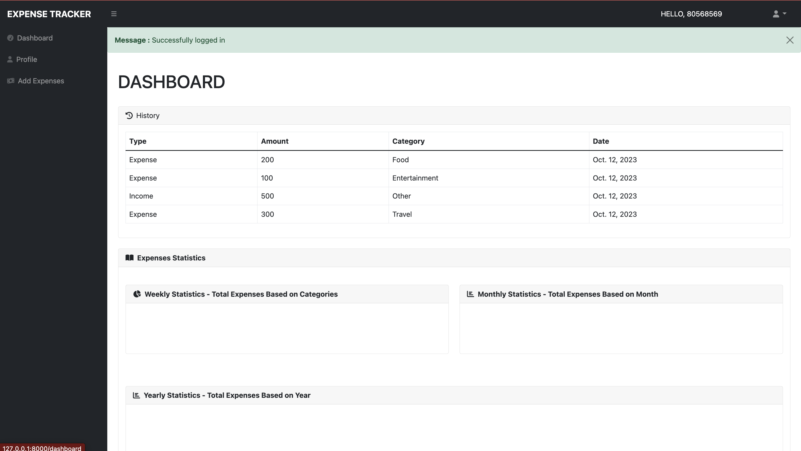

# Expense Tracker

A simple and efficient expense tracking application to help you manage your finances effectively.

## Features

- Add, edit, and delete expenses.
- Categorize expenses for better organization.
- View expense summaries and reports.
- User-friendly interface.

## Technologies Used

- **Frontend**: HTML,CSS,Bootstrap
- **Backend**: Django
- **Database**: Sqlite3

## Installation

1. Clone the repository:
    ```bash
    git clone https://github.com/your-username/expense-tracker.git
    ```
2. Navigate to the project directory:
    ```bash
    cd expense-tracker
    ```
3. Install dependencies:
    ```bash
    npm install
    ```
4. Start the development server:
    ```bash
    npm start
    ```

## Usage

1. Open the application in your browser at `http://localhost:3000`.
2. Create an account or log in.
3. Start adding and managing your expenses.

## Screenshots

Here are some screenshots of the Expense Tracker application:

### Expense Summary


### Login


### Register


### Dashboard


### Profile


### Add Expense


## License

This project is licensed under the [MIT License](LICENSE).

## Contact

For any questions or feedback, please reach out to the project maintainer:

**Name**: M Ramanathan  
**Phone**: +91 80568 56956  
**Email**: rsai48838@gmail.com